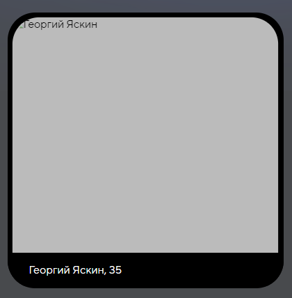
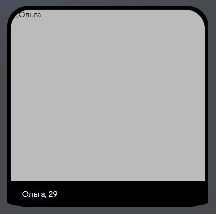

# Домашние задание №1 по курсу "Обеспечение качества в разработке ПО"

### Исполнители:
- Толкачев Родион
- Доллматов Федор
- Атрошко Никита

## Регистрация и авторизация

## Страница настроек пользователя

## Лента с выбором карточек
- При нажатии на зеленую кнопку с галочкой происходит лайк, и карточка улетает вправо ✅
- При нажатии на красную кнопку с крестиком происходит дизлайк, и карточка улетает влево ✅
- При нажатии на кнопку по середине появляется модальное окно с возможностью пожаловаться на данного пользователя
  - При нажатии на предложенные причины жалоб они выделяются зеленым ✅
  - При выборе причины и нажатии на кнопку Пожаловаться появляется небольшое уведомление на 1 секунду, что жалоба отправлена ✅
  - При отправке жалобы без выбора причины приходит оповещение, что что-то не так, а с сервера приходит ошибка 500 ❌
    > **[Баг]**
    > 
    > Ожидаемый результат: появление предупреждения, что причина не выбрана и просьба выбрать причину
  - При нажатии кнопки Отмена модальное окно закрывается ✅
  - При нажатии области вне модального окна модальное окно закрывается ✅
- Если пользователь добавил больше одной фотографии, то есть возможность пролистать его фотографии ✅
- При листании фотографий в карточке отправляется запрос на дизлайк ❌
    > **[Баг]**
    > 
    > Ожидаемый результат: никаких лишних запросов
- Для мобильных устройств и планшетов ненужный запрос на дизлайк происходит при нажатии на карточку для информации про пользователя и повторном нажатии, чтобы вернуться к просмотру изображений ❌
    > **[Баг]**
    > 
    > Ожидаемый результат: никаких лишних запросов
## Страница с мэтчами пользователя
- При вводе в инпут поиска происходит поиск по имени человека ✅
- При фильтрации пользователей если пришло 4 пользователя появляется большой отсуп между линиями ❌
    > **[Баг]**
    > 
    > Ожидаемый результат: обычный отступ как и при полностью заполненной сетке
- При наведении на карточки пользователя появляется шкала внизу с именем и возрастом человека
- При наведении на некоторых пользователей шкала снизу вылазиет из формы карточки ❌
    > **[Баг]**
    > 
    > Ожидаемый результат:
    > 
    > 
    > Фактический результат:
    > 
- При нажатии на карточку пользователя появляется модальное окно с расширенной информации о человеке, кнопки для перехода в чат с пользователем и кнопки для закрытия модального окна
  - При нажатии на кнопку происходит переход на страницу с чатом с выбранным пользователем ✅
  - При нажатии на кнопку закрытия происходит закрытие модального окна ✅
  - При нажатии на область вне модального окна происходит закрытие модального окна ✅  
## Страница с чатами
